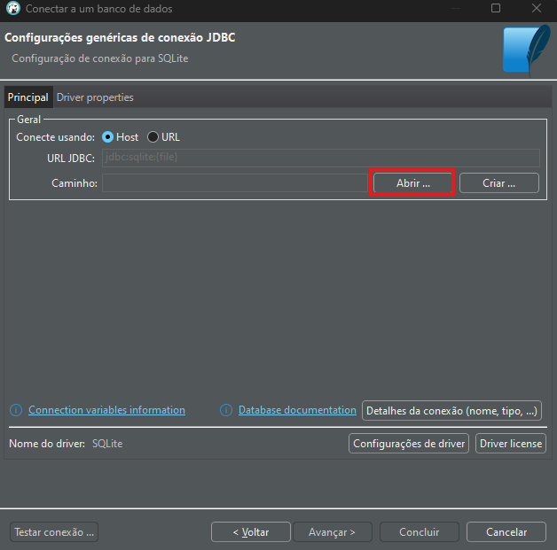
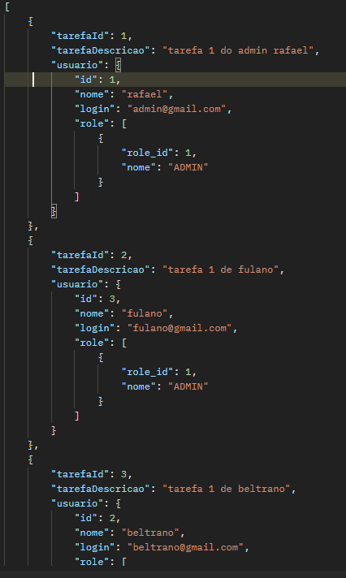
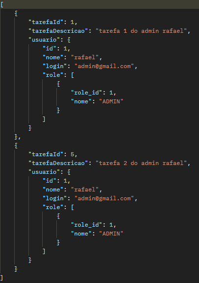
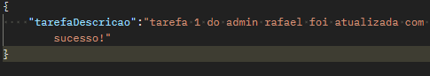
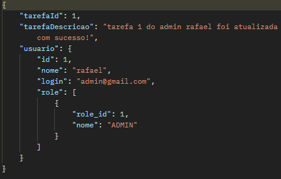
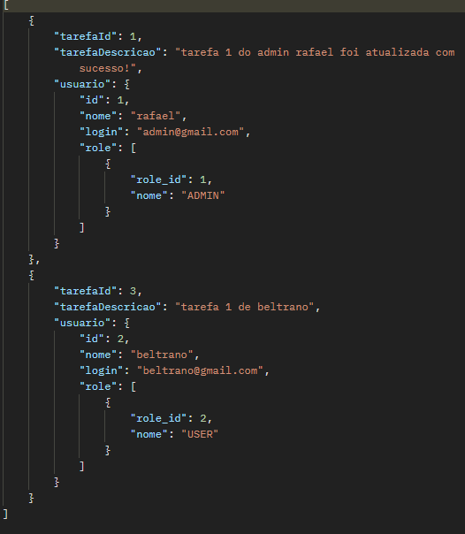

# Descrição
Esta é um API RESTful para gerenciamento de tarefas, na qual, após cadastro previo do usuário, ele poderá realizar a criação, atualização, deleção e pesquisa de suas respectivas tarefas. Em caso de ser um usuário com permissões de administrador, terá funcionalidades extras. Todavia, é preciso passar pela sessão de autenticação e autorização para então ter acesso aos recursos.

# Indice
- <a href="#pré-requisitos">Pré-requisitos</a>
- <a href="#tecnologias-e-ferramentas">Tecnologias e Ferramentas</a>
- <a href="#layout-do-projeto">Layout do projeto</a>
    - <a href="#banco-de-dados">Banco de dados</a>
    - <a href="#estrutura">Estrutura</a>
- <a href="#configurações">Configurações</a>
    - <a href="#github">Github</a>
    - <a href="#dbeaver">DBeaver</a>
    - <a href="#postman">Postman</a>
- <a href="#endpoints">Endpoints</a>
    - <a href="#autenticação">Autenticação</a>
    - <a href="#usuario-admin">Usuário Admin</a>
    - <a href="#usuario-comum">Usuário Comum</a>
    - <a href="#tarefas">Tarefas</a>

# Pré-requisitos
- Java 17
- IDE (recomendado: Intellij)
- API Client (recomendado: Postman)
- Administrador de Banco de dados (recomendado: DBeaver)

# Tecnologias e ferramentas
- Java 17
- Spring Boot
- Spring Security
- Spring JPA
- OAuth 2.0
- JWT (Jason Web Token)
- Postman
- Banco de dados SQLite 3
- Docker

# Layout do projeto
## Banco de dados
<br>

## Estrutura
```plaintext
trilhabackend/
│
├── .mvn/                   
├── assets/                 
├── src/                    
│   ├── main/
│   │   ├── java/
│   │   │   └── com/
│   │   │       └── codigocerto/
│   │   │           └── trilhabackend/
│   │   │               ├── config/
│   │   │               │   ├── ConfiguracaoSeguranca.java
│   │   │               │   └── ConfigUsuarioAdmin.java
│   │   │               ├── controllers/
│   │   │               │   ├── dtos/
│   │   │               │   │   ├── requests/
│   │   │               │   │   │   ├── AutenticacaRequest.java
│   │   │               │   │   │   ├── TarefaRequest.java
│   │   │               │   │   │   └── UsuarioRequest.java
│   │   │               │   │   ├── responses/
│   │   │               │   │   │   ├── AutenticacaoResponse.java
│   │   │               │   │   │   └── UsuarioResponse.java
│   │   │               │   ├── exceptions/
│   │   │               │   │   └── GlobalExceptionHandler.java
│   │   │               │   ├── security/
│   │   │               │   │   └── AutenticacaoController.java
│   │   │               │   ├── TarefaController.java
│   │   │               │   └── UsuarioController.java
│   │   │               ├── entities/
│   │   │               │   ├── Role.java
│   │   │               │   ├── Tarefa.java
│   │   │               │   └── Usuario.java
│   │   │               ├── repositories/
│   │   │               │   ├── RoleRepository.java
│   │   │               │   ├── TarefaRepository.java
│   │   │               │   └── UsuarioRepository.java
│   │   │               ├── services/
│   │   │               │   ├── exceptions/
│   │   │               │   │   ├── EmptyCredentialsException.java
|   |   |               |   |   ├── IncorrectCredentialsException.java
│   │   │               │   │   └── ResourceNotFoundException.java
│   │   │               │   ├── security/
│   │   │               │   │   └── AutenticacaoService.java
│   │   │               │   ├── TarefaService.java
│   │   │               │   └── UsuarioService.java
│   │   │               └── TrilhabackendApplication.java
│   │   └── resources/
│   │       ├── static/
│   │       ├── templates/
│   │       ├── app.key
│   │       ├── app.pub
│   │       ├── application.properties
│   │       └── data.sql
│   └── test/
├── .classpath              
├── .gitignore              
├── .project                
├── HELP.md                 
├── mvnw                    
├── mvnw.cmd                
├── mydatabase.db
└── pom.xml
```

# Configurações
## Github
Faça um clone deste repositório em sua máquina. Basta copiar o código abaixo, abrir algum bash, como o próprio Git Bash, colar e dar enter.
```bash
git clone https://github.com/devrafael/TrilhaBackEndJR-JUN15
```
## DBeaver
Com o projeto já clonado para sua máquina, hora de configurar o banco de dados.
Abra o DBeaver e clique neste botao para criar uma conexão

<br>

Em seguida, selecione o banco de dados, que neste caso, é o SQLite. Caso solicite a istalação de algum driver, basta clicar em "download" que o driver será instalado automaticamente.

<br>

Com o SQLite selecionado, agora é o momento de configuração da conexão. No caso do SQLite, uma das formas é mapear o caminho de algum arquivo de base de dados previamente criada, como é o caso. Clique no botão "Abrir..." e localize onde foi salvo o clone do projeto e lá será encontrado um arquivo chamado "mydatabase.db".

<br>

Selecione o arquivo "mydatabase.db" e clique em "Abrir".

<br>

Basta testar a conexão para confirmação de que tudo foi configurado corretamente, e pronto!

<br>

## Postman
Um arquivo no formato "JSON" chamado de "requisicoes.json" está presente no diretório do projeto. Abra o Postman e clique no botão "Import".

<br>

Agora, clique em "Files", localize o arquivo, e pronto, todas as requisições possíveis já estarão prontas para uso. Lembrando que, em sua maioria, é necessário a autenticação.

<br>

# Endpoints
Com exceção do endpoint de cadastramento de um usuário comum, todos os outros requerem autenticação prévia.

OBS.: Caso a url presente em cada um dos métodos não estiver funcionando, será preciso realizar a configuração do banco de dados através de um gerenciador de banco de dados e utilzar a url "http://localhost/8080" seguido da rota e método respectivo.


## Autenticação
Descrição: Requisição para realizar autenticação de um usuário previamente cadastrado.

- Método: GET
- URL: https://trilhabackendjr-jun15-usip.onrender.com/auth


 Token de autenticação: Ao se autenticar, um token será gerado e seu tempo de expiração. Para conseguir acessar os outros endpoints, basta copiar esse token (sem as aspas) e antes de enviar a requisição, acessar a seção "Authorization/Auth", selecionar "Bearer Token", colar o token, e por fim, enviar a requisição.


## Usuario ADMIN
Apenas os usuários com permissões de administrador, possuem acesso a estes endpoints.

### Buscar todos os usuários cadastrados
Descrição: Requisição para realizar a busca de todos os usuários cadastrados.

- Método: GET
- URL: https://trilhabackendjr-jun15-usip.onrender.com/usuarios/admin


### Buscar Usuário 
Descrição: Requisição para realizar a busca de apenas um usuário cadastrado pelo seu ID.

- Método: GET
- URL: https://trilhabackendjr-jun15-usip.onrender.com/usuarios/{id}

Obs.: Substituir "{id}" pelo ID do usuário cadastrado. 

Neste caso, foi buscado as informações do usuário com ID igual a 1.


### Criar Usuário
Descrição: Requisição para realizar o cadastramento de um usuário com permissões de administrador.

- Método: POST
- URL: https://trilhabackendjr-jun15-usip.onrender.com/usuarios/admin

Para realizar o cadastramento, é necessário passar um corpo com os seguintes atributos: nome, senha e login. Abaixo, é possível visualizar essas informações além da confirmação de que o usuário foi criado corretamente.


### Atualizar Usuário
Descrição: Requisição para realizar a atualização de um usuário cadastrado pelo seu ID.

- Método: PUT
- URL: https://trilhabackendjr-jun15-usip.onrender.com/usuarios/{id}

Obs.: Substituir "{id}" pelo ID do usuário cadastrado. 

Neste caso, o usuário escolhido foi o de ID igual a 2. Para este exemplo, apenas o nome dele foi alterado, entretanto, os campos login e senha também podem ser alterados, de forma exclusiva como o exemplo ou em conjunto.


### Deletar Usuário
Descrição: Requisição para realizar a deleção de um usuário cadastrado pelo seu ID.

- Método: DELETE
- URL: https://trilhabackendjr-jun15-usip.onrender.com/usuarios/{id}

Obs.: Substituir "{id}" pelo ID do usuário cadastrado.

Novamente, o usuário escolhido a ser deletado foi o de ID igual a 2. Ao realizar um requisição para buscar todos os usuários cadastrados, é possível notar apenas o usuário de ID igual a 1 e 3 respectivamente. Ou seja, a exclusão do usuário de ID 2 foi realizada com sucesso.


## Usuario Comum
### Criar Usuario

Descrição: Este é o endpoint destinado ao cadastramento de um usuário com permissões básicas, tendo funcionalidades limitadas.

- Método: POST
- URL: https://trilhabackendjr-jun15-usip.onrender.com/usuarios

Assim como para criar um usuário com permissões de administrador, basta informar, no corpo da requisição, os atributos: nome, senha e login.


## Tarefas
### Buscar todas as tarefas de todos respectivos usuários cadastrados 
Descrição: Requisição para realizar a busca de todas as tarefas dos respectivos usuários cadastrados.

- Método: GET
- URL: https://trilhabackendjr-jun15-usip.onrender.com/tarefas/admin



### Buscar uma única tarefa, pelo seu respectivo ID, de um usuário cadastrado
Descrição: Requisição para realizar a busca de apenas uma tarefa, através do seu respectivo ID, de um usuário cadastrado.

- Método: GET
- URL: https://trilhabackendjr-jun15-usip.onrender.com/tarefas/{id}

Obs.: Substituir "{id}" pelo ID da tarefa cadastrada.

Para este exemplo, a tarefa especifica buscada foi a de ID (tarefaId) igual a 1, que pertece ao usuário de ID igual a 1.


### Buscar todas as tarefas pelo ID de um usuário cadastrado
Descrição: Requisição para realizar a busca de todas as tarefa de um usuário cadastrado através do seu ID.

- Método: GET
- URL: https://trilhabackendjr-jun15-usip.onrender.com/tarefas/usuarios/{id}

Para esta requisição, buscou-se todas as tarefas apenas do usuário de ID igual a 1.

Obs.: Substituir "{id}" pelo ID do usuário cadastrado.



### Criar Tarefa
Descrição: Requisição para realizar o cadastramento de uma tarefa.

- Método: POST
- URL: https://trilhabackendjr-jun15-usip.onrender.com/tarefas


### Atualizar Tarefa
Descrição: Requisição para realizar a atualização do conteúdo de uma tarefa através do seu respectivo ID.

- Método: PUT
- URL: https://trilhabackendjr-jun15-usip.onrender.com/tarefas/{id}

Obs.: Substituir "{id}" pelo ID da tarefa cadastrada.

Nesta requisição a tarefa escolhida para ter seu conteudo atualizado foi a de ID igual a 1. Para realizar a alteração, basta informar no corpo da requisição o atributo "tarefaDescricao".




### Deletar Tarefa
Descrição: Requisição para realizar a deleção de uma tarefa através do seu respectivo ID.

- Método: DELETE
- URL: https://trilhabackendjr-jun15-usip.onrender.com/tarefas/{id}

Obs.: Substituir "{id}" pelo ID da tarefa cadastrada.

A tarefa escolhida a ser deletada foi o de ID igual a 2. Ao realizar um requisição para buscar todos os usuários cadastrados, é possível notar que restaram apenas as tarefas de ID igual a 1 e 3, respectivamente. Ou seja, a exclusão da tarefa de ID 2 foi realizada com sucesso.




